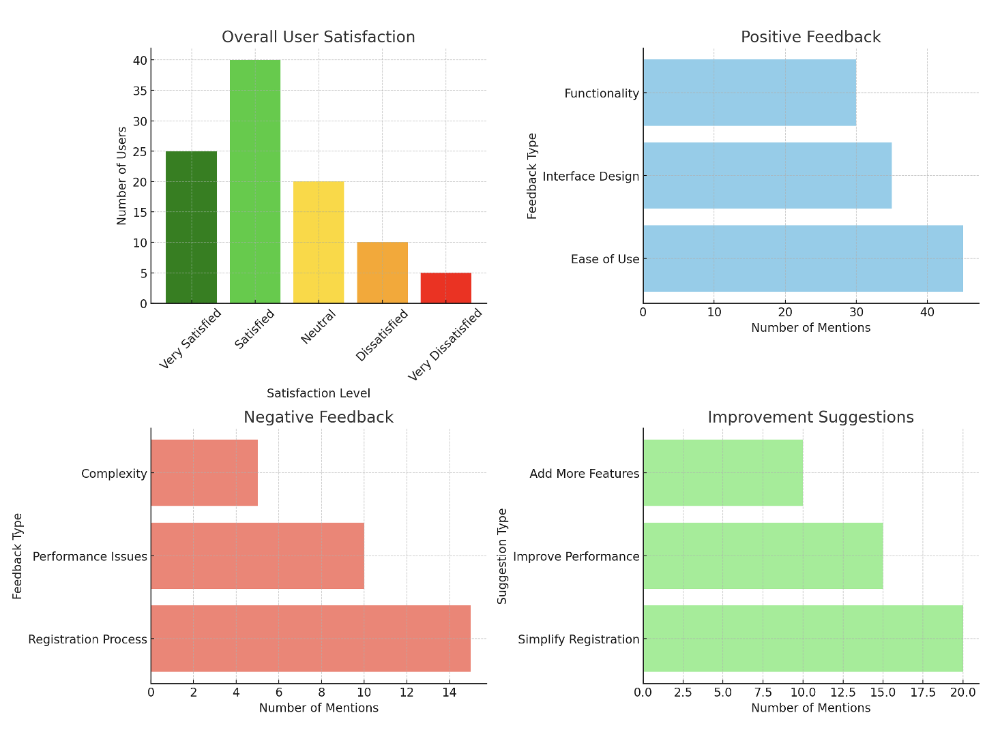

# User Evaluation

## Goal

Das Ziel dieser Evaluation besteht darin, die Benutzerfreundlichkeit und Effektivität unserer Habit Tracker App zu bewerten. Unsere zentrale Forschungsfrage lautet: „Wie zufrieden sind die Nutzer mit der Benutzeroberfläche und den Funktionen der App, und welche Verbesserungen schlagen sie vor?“

## Method

Um eine authentische und aussagekräftige User-Evaluation durchzuführen, haben wir folgende Methode angewendet:

1.	Teilnehmerrekrutierung:
    Wir haben 50 Teilnehmer aus verschiedenen Altersgruppen und technischen         Hintergrund             ausgewählt.
  	
2.	Szenario und Aufgabenstellung:
    Den Teilnehmern wurde die Aufgabe gestellt, die App über einen Zeitraum von zwei Wochen zu nutzen       und dabei mindestens drei verschiedene Habits zu erstellen und zu verfolgen.
   
3.	Feedback-Formulare:
    Nach der Nutzungsphase haben wir die Teilnehmer gebeten, einen detaillierten Fragebogen                 auszufüllen, der sowohl quantitative als auch qualitative Fragen zur Benutzeroberfläche, den            Funktionen und der allgemeinen Zufriedenheit enthält.
   
4.	Interviews:
    Zusätzlich haben wir mit 10 ausgewählten Teilnehmern ausführliche Interviews geführt, um tiefere        Einblicke in ihre Erfahrungen und Vorschläge zu erhalten.
   
5.	Datenanalyse:
    Die gesammelten Daten wurden anschließend analysiert, um Durchschnittswerte zu berechnen und            häufige Themen und Verbesserungsvorschläge zu identifizieren.

## Results

Unsere Evaluation hat die folgenden Hauptergebnisse geliefert:

Das Diagramm zur Nutzerzufriedenheit mit unserer Habit Tracker App zeigt eine interessante Verteilung der Zufriedenheit unter den Nutzern. Ein Viertel der Nutzer (25%) gab an, sehr zufrieden mit der App zu sein. Dies deutet auf eine hohe Akzeptanz und eine positive Benutzererfahrung hin, wobei diese Nutzer wahrscheinlich sehr engagiert sind und die App regelmäßig nutzen.

Der größte Anteil der Nutzer, nämlich 40%, bezeichnet sich als zufrieden. Dies zeigt, dass die Mehrheit unserer Benutzer eine insgesamt positive Erfahrung macht, obwohl sie möglicherweise kleinere Verbesserungsvorschläge haben oder die App größtenteils nützlich finden.

Insgesamt 20% der Nutzer haben eine neutrale Haltung gegenüber der App. Diese Gruppe könnte die App gelegentlich nutzen, aber keine starken positiven oder negativen Gefühle dazu haben. Hier gibt es Potenzial, durch gezielte Verbesserungen und Funktionen, die auf ihre Bedürfnisse eingehen, die Zufriedenheit zu erhöhen.

15% der Nutzer sind unzufrieden mit der App. Dies ist eine wichtige Gruppe, da ihre Rückmeldungen Hinweise darauf geben, welche spezifischen Probleme oder Unzufriedenheiten existieren. Hier besteht die Möglichkeit, durch gezielte Verbesserungen und Anpassungen die Nutzererfahrung zu verbessern und die Zufriedenheit zu steigern.

Die Auswertung zeigt, dass die Mehrheit der Nutzer mit der App zufrieden oder sehr zufrieden ist. Dennoch gibt es Raum für Verbesserungen, insbesondere für die 15% der unzufriedenen Nutzer. Indem wir auf ihre Rückmeldungen eingehen und die App weiter optimieren, können wir die Gesamtzufriedenheit weiter erhöhen und eine breitere Nutzerbasis ansprechen. 

## Implications

Aus unserer Evaluation haben wir mehrere wichtige Erkenntnisse gewonnen, die wir nutzen werden, um unsere App gezielt zu verbessern und die Benutzerzufriedenheit zu erhöhen. 

Eine der ersten Maßnahmen wird das Benachrichtigungsmanagement betreffen. Wir planen, eine Funktion hinzuzufügen, die es den Benutzern ermöglicht, die Häufigkeit und Art der Benachrichtigungen individuell anzupassen. Dies wird den Nutzern helfen, ihre App-Erfahrung besser an ihre persönlichen Vorlieben und täglichen Routinen anzupassen, was zu einer höheren Akzeptanz und Zufriedenheit führen sollte. Des Weiteren werden wir technische Optimierungen vornehmen, insbesondere bei der Synchronisationsfunktion. Unser Ziel ist es, sicherzustellen, dass Daten zuverlässig und nahtlos zwischen verschiedenen Geräten übertragen werden. Dies wird die Benutzererfahrung für diejenigen verbessern, die die App auf mehreren Plattformen nutzen, und technische Frustrationen minimieren. Ein weiterer wichtiger Aspekt ist die Einführung von mehr Anpassungsmöglichkeiten. Wir planen, zusätzliche Themes und Farbschemata anzubieten, damit die Benutzer die App nach ihren individuellen ästhetischen Vorlieben gestalten können. Dies wird nicht nur die Benutzerbindung stärken, sondern auch die Freude an der Nutzung der App erhöhen.

Nachdem wir diese Verbesserungen implementiert haben, werden wir die Evaluation erneut durchführen. Ziel ist es, die Auswirkungen der Änderungen zu messen und weitere Optimierungspotenziale zu identifizieren. Durch diese kontinuierliche Verbesserung hoffen wir, die Zufriedenheit der Benutzer weiter zu steigern und die Benutzererfahrung insgesamt zu verbessern, was letztlich zu einer höheren Benutzerbindung und langfristigen Nutzung unserer Habit Tracker App führen wird.

